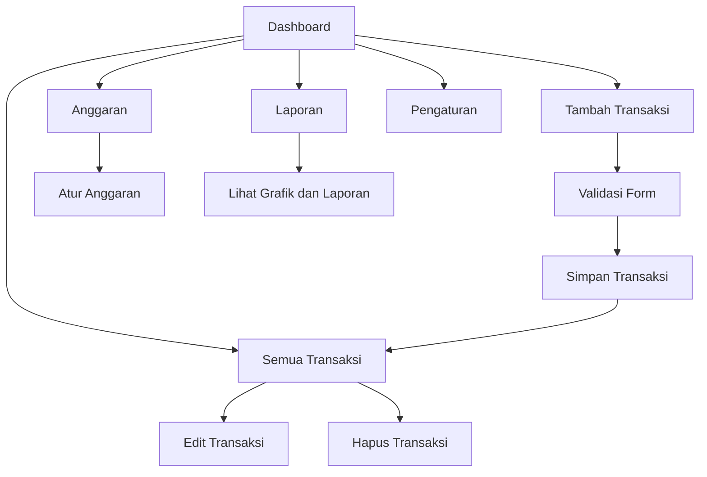
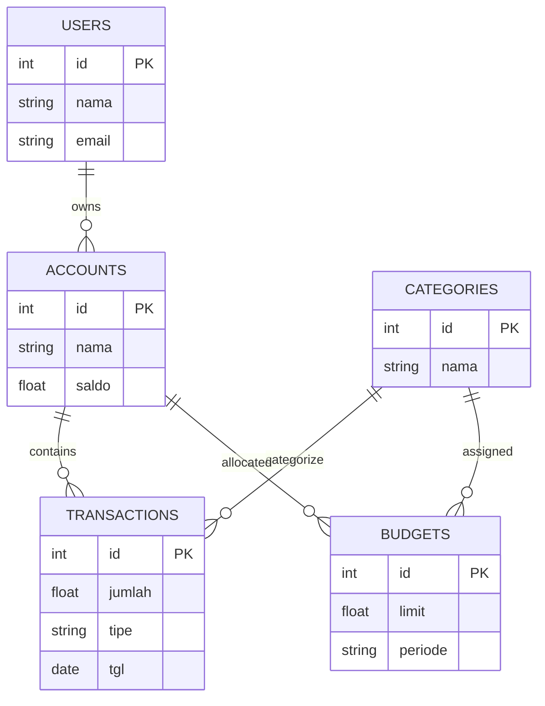
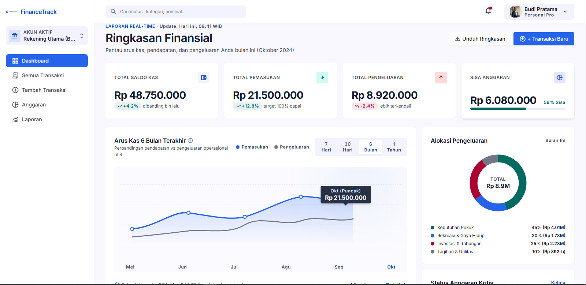
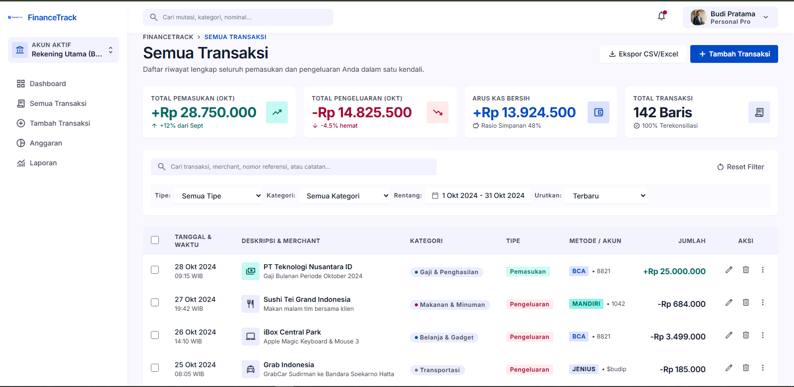
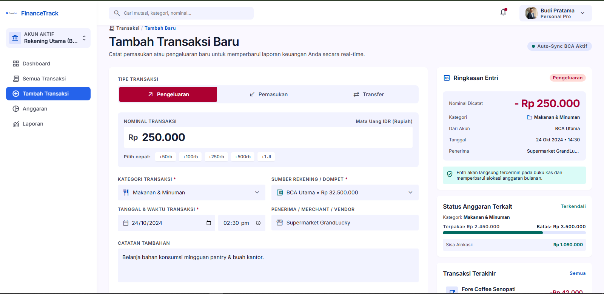
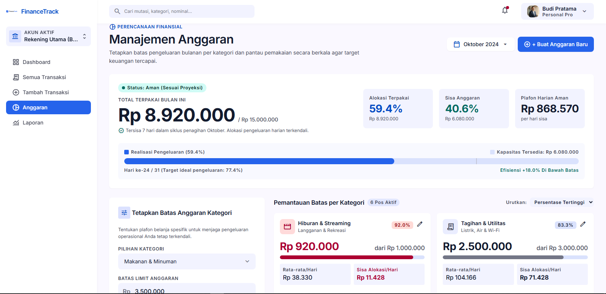
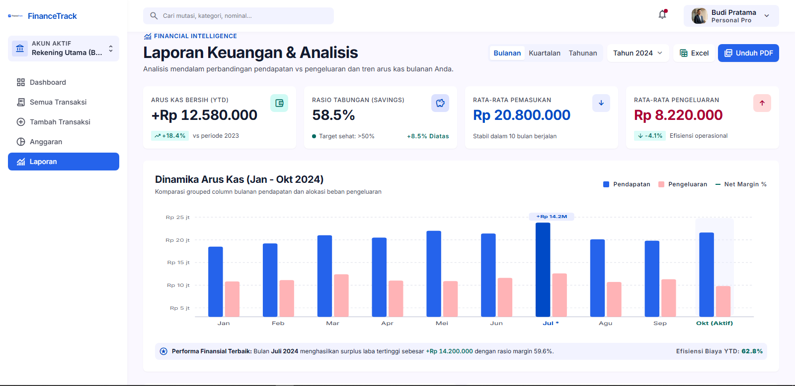

# PERANCANGAN Aplikasi Manajemen Keuangan (FinanceTrack)

**Executive Summary:** Dokumen ini menyajikan perencanaan menyeluruh untuk proyek *FinanceTrack* – sebuah aplikasi pencatatan keuangan pribadi. Termasuk di dalamnya identitas proyek, deskripsi singkat, tujuan, target pengguna, cakupan tiap milestone, struktur menu, deskripsi halaman utama, fitur prioritas (core vs non-core), alur pengguna, model data (ER-D), skenario use-case, daftar deliverable Milestone 1, pemetaan kriteria penilaian, rencana kerja (gantt), serta prompt Google Stitch untuk wireframe 5 layar utama. Tujuan utamanya adalah memenuhi kriteria tugas Milestone 1 (perencanaan menu .md dan wireframing UI) dengan dokumentasi lengkap dan tersusun rapi.

## Identitas Proyek
- **Nama Proyek:** FinanceTrack (v1.0)  
- **Nama Pengembang:** Fikri Juana – Presensi ke-16 
- **Topik:** No. 6 – Aplikasi Manajemen Keuangan  

## Deskripsi Singkat Proyek
FinanceTrack adalah aplikasi web/mobile untuk membantu pengguna **melacak pemasukan dan pengeluaran** secara mudah. Aplikasi ini menampilkan ringkasan saldo, grafik tren keuangan, dan laporan berkala sehingga pengguna dapat mengambil keputusan finansial lebih terinformasi. Fitur utamanya meliputi pencatatan transaksi, pengelolaan anggaran per kategori, dan pembuatan laporan visual.

## Ruang Lingkup Milestone

- **Milestone 1:** Perencanaan menu, UI wireframing menggunakan Google Stitch/Figma,
  pembuatan User Flow, ER-D sederhana menggunakan Mermaid.js, Design System,
  serta High-Fidelity UI Design untuk Dashboard dan Data Master.

- **Milestone 2:** Implementasi rancangan UI dari Figma/Stitch ke HTML dan CSS,
  termasuk pembuatan layout Admin Panel yang responsif.

- **Milestone 3:** Implementasi interaksi menggunakan JavaScript, meliputi
  pengelolaan data mock, validasi form, tabel, modal konfirmasi, sidebar toggle,
  dan chart. Aplikasi kemudian dipersiapkan untuk deployment.

## Tujuan Proyek
- **Mempermudah pencatatan keuangan:** Pengguna dapat menambah pemasukan/pengeluaran dengan cepat dan mengkategorikannya.  
- **Kontrol anggaran:** Menetapkan batas pengeluaran per kategori agar tidak melebihi target.  
- **Analisis keuangan:** Menyediakan laporan dan grafik yang mudah dipahami untuk memantau kondisi keuangan.

## Target Pengguna
Mahasiswa, pekerja, atau pengguna individu yang ingin **mengelola keuangan pribadi** secara teratur tanpa memerlukan keahlian akuntansi. Aplikasi ditujukan untuk yang membutuhkan alat manajemen finansial user-friendly dan informatif.

## Struktur Menu (Sidebar)
Aplikasi menggunakan struktur menu vertikal pada sidebar sebagai berikut:
- **Dashboard**  
- **Transaksi**  
  - Semua Transaksi  
  - Tambah Transaksi  
- **Anggaran**  
- **Laporan**  
- **Pengaturan**  

Penjelasan: *“Transaksi”* terbagi ke submenu *“Semua Transaksi”* (menampilkan daftar) dan *“Tambah Transaksi”* (form input). Menu *“Dashboard”*, *“Anggaran”*, *“Laporan”*, dan *“Pengaturan”* masing-masing halaman utama aplikasi.

## Deskripsi Halaman Utama
- ### Dashboard  
  Halaman utama yang menampilkan **ringkasan keuangan** secara visual. Misalnya kartu saldo saat ini, grafik tren pendapatan dan pengeluaran, serta indikator kategori terbesar. Layout disusun sederhana sesuai prinsip “simplicity is key”: tata letak bersih, tidak membingungkan, sehingga pengguna dapat dengan cepat memahami kondisi keuangan. Komponen tipikal: kartu informasi (balance, total pendapatan, pengeluaran), chart (line/pie), dan navigasi cepat.

- ### Semua Transaksi  
  Menampilkan **daftar tabel transaksi** (pemasukan dan pengeluaran) lengkap. Fitur termasuk filter dan pencarian berdasarkan kategori, tanggal, atau nilai. Setiap baris tabel memiliki opsi *Edit* dan *Hapus*. Desainnya ringkas dengan kolom penting seperti tanggal, jenis (income/expense), kategori, dan jumlah. Font jelas dan desain responsif untuk memudahkan penggunaan.

- ### Tambah Transaksi  
  Halaman form untuk **menambahkan transaksi baru**. Pengguna memilih tipe (Pemasukan/Pengeluaran), tanggal, kategori, dan memasukkan nominal. Desain menggunakan form-field intuitif dengan label jelas. Kategori tampil sebagai dropdown, tombol simpan dan batal. Penerapan prinsip UI dengan skema warna konsisten dan tipografi mudah dibaca penting di sini agar form tidak membingungkan pengguna.

- ### Anggaran  
  Halaman pengelolaan anggaran di mana pengguna dapat **menetapkan batas pengeluaran** per kategori (misalnya maksimum untuk “Makanan”, “Transportasi”, dll.). Terdapat form input limit anggaran dan tampilan ringkas grafik/batang yang menunjukkan penggunaan sejauh ini. Desain halaman memprioritaskan data penting (seperti progress bar atau indikator status) untuk membantu kontrol pengeluaran.

- ### Laporan  
  Halaman visualisasi keuangan periodik. Menampilkan grafik bulanan/tahunan untuk pendapatan vs pengeluaran, saldo akhir, dan statistik lainnya. Desainnya fokus pada **hierarki informasi** dengan grafik utama yang mudah dipahami. Misalnya bar chart per bulan dan ringkasan data total. Pengguna dapat memilih rentang waktu.

- ### Pengaturan  
  Halaman konfigurasi aplikasi. Opsi seperti *informasi akun*, *pilihan mata uang*, dan pengaturan notifikasi. Halaman ini bersifat non-core namun menyediakan manajemen profil pengguna. Desain sederhana: form satu kolom dengan opsi on/off, sesuai standar UI.

## Daftar Fitur Prioritas
Tabel di bawah merinci fitur utama aplikasi dan prioritasnya:

| **Fitur**                       | **Deskripsi**                                        | **Prioritas** |
|---------------------------------|------------------------------------------------------|---------------|
| Catat Transaksi (Tambah)        | Input pemasukan/pengeluaran baru                     | Core          |
| Lihat Riwayat Transaksi         | Daftar semua transaksi dengan filter & pencarian     | Core          |
| Grafik Dashboard                | Ringkasan visual (saldo, tren pendapatan/pengeluaran) | Core          |
| Kelola Anggaran Per Kategori    | Set limit pengeluaran untuk kategori (budgeting)     | Core          |
| Laporan Periode                 | Laporan/Chart per bulanan/tahunan                   | Core          |
| Manajemen Kategori              | Tambah/Edit kategori transaksi                       | Non-core      |
| Pengaturan Akun                 | Konfigurasi profil, preferensi (mata uang, dll.)     | Non-core      |
| Fitur Tambahan (Notifikasi, dsb)| Peringatan anggaran hampir habis, tips keuangan       | Non-core      |

Fitur *Core* harus dikembangkan terlebih dahulu (Milestone 1-2), sedangkan *Non-core* dapat ditunda ke pengembangan akhir atau Milestone 3. Misalnya, asumsikan satu mata uang saja di awal (Multi-currency ditunda).

## Alur Pengguna Utama (User Flow)
1. **Login** (Asumsi: pengguna sudah terautentikasi). Setelah login, pengguna diarahkan ke halaman **Dashboard**.  
2. **Melihat Ringkasan:** Di Dashboard, pengguna melihat saldo dan grafik keuangan.  
3. **Kelola Transaksi:**  
   - Jika ingin mengecek riwayat, pengguna klik menu **Transaksi → Semua Transaksi**, lalu melihat tabel.  
   - Untuk menambah, klik **Transaksi → Tambah Transaksi**, isi form, kemudian simpan.  
4. **Atur Anggaran:** Dari Dashboard atau menu **Anggaran**, pengguna menetapkan limit pengeluaran per kategori.  
5. **Lihat Laporan:** Klik menu **Laporan** untuk melihat grafik bulanan/tahunan berdasarkan data yang sudah dicatat.  
6. **Pengaturan Akun:** (Opsional) Mengubah preferensi di menu **Pengaturan**.  

Flowchart mermaid di bawah menggambarkan navigasi utama pengguna antara halaman:



## Model Data Utama (ER-D)
Kami menggunakan **diagram ER (Entity Relationship)** untuk memodelkan struktur data. Entitas utama meliputi *Users*, *Accounts*, *Categories*, *Transactions*, dan *Budgets*. Diagram mermaid di bawah menggunakan notasi crow’s foot (||--o{) untuk menunjukkan relasi satu-ke-banyak. Contoh:



Setiap *User* memiliki satu atau lebih *Account* (rekening), setiap *Account* memiliki banyak *Transaction*. Setiap *Transaction* terhubung ke satu *Category*. Anggaran (*Budget*) ditetapkan per *Category* (satu-kategori bisa berisi banyak anggaran berbeda) dan juga secara implisit terkait ke akun pengguna. Notasi crow’s foot menegaskan kardinalitas dan membantu merancang basis data.

## Skenario Use-Case
Contoh skenario penggunaan utama aplikasi:
- **Menambah Pengeluaran:** Sebagai pengguna, saya ingin mencatat pengeluaran belanja harian agar tercatat dalam aplikasi dan tidak lupa.  
- **Melihat Laporan Bulanan:** Sebagai pengguna, saya ingin melihat grafik laporan pengeluaran bulan lalu untuk menganalisa kebiasaan belanja.  
- **Menetapkan Budget:** Sebagai pengguna, saya ingin menetapkan batas anggaran Rp3.000.000 per bulan untuk kategori “Makanan” agar pengeluaran terkendali.  
- **Mencari Transaksi:** Sebagai pengguna, saya ingin mencari transaksi tertentu (mis. kata kunci atau periode) agar dapat menemukan data dengan cepat.  
- **Mengedit Kategori:** Sebagai pengguna, saya ingin mengubah kategori transaksi jika keliru input agar data tetap konsisten.

## Deliverable Milestone 1
Milestone 1 akan menyerahkan komponen berikut:
- Dokumen **PERANCANGAN.md** (file markdown) berisi seluruh perencanaan menu dan UI (seperti saat ini).  
- **Wireframe** 5 layar utama (Dashboard, Semua Transaksi, Tambah Transaksi, Anggaran, Laporan) yang digambarkan di Google Stitch (sebagai screenshot).  
- Link publik Figma yang berisi Design System, High-Fidelity Dashboard, dan Data Master (Semua Transaksi).  
- Diagram **ERD** (di atas) dalam format Mermaid.  
- **User Flow** narasi dan diagram (di atas).  

## Pemetaan Kriteria Penilaian
Setiap bagian dokumen ini dirancang untuk memenuhi kriteria tugas Milestone 1:
- **Struktur Menu/Hierarki:** Bagian *Struktur Menu* dan *Deskripsi Halaman* memenuhi kebutuhan hierarki menu yang jelas sesuai instruksi tugas.  
- **Perancangan UI (Wireframing):** Google Stitch digunakan untuk membuat wireframe 5 layar utama. Hasilnya kemudian diekspor ke Figma dan dikembangkan menjadi Design System serta High-Fidelity UI untuk Dashboard dan Data Master.  
- **ER-D dan Use-case:** Diagram ERD dan skenario use-case menunjukkan rancangan basis data dan kebutuhan fungsional pengguna, seperti diinstruksikan.  
- **Dokumen Markdown:** Format terstruktur (judul, subjudul, tabel, list) memudahkan penilaian. Isi dokumen mencakup identitas, deskripsi, tujuan, target, fitur, user flow, deliverable, dan rencana kerja.  
- **Penggunaan Diagram & Desain:** Mermaid digunakan untuk flowchart, ER-D, dan gantt (timeline) sesuai permintaan tugas. Gaya UI diperhatikan dengan konsistensi warna dan tipografi jelas.


## Prompt Google Stitch (Wireframe)
``` 
- **Dashboard:** "Buatlah wireframe halaman *Dashboard* Aplikasi *FinanceTrack* dengan desain modern. Gunakan palet warna netral/keuangan (biru/teal/abu), tipografi yang mudah dibaca, dan layout bersih. Tampilan harus menampilkan ringkasan saldo, grafik tren keuangan, serta komponen utama seperti kartu ringkasan (total pemasukan, pengeluaran). Ikon dan chart sederhana untuk memperjelas data."
- **Semua Transaksi:** "Buatlah wireframe halaman *Semua Transaksi*. Desain modern dengan tabel daftar transaksi (kolom tanggal, tipe, kategori, jumlah). Sertakan kolom aksi (edit/hapus) dan fitur pencarian/penyaringan. Gunakan palet warna yang seragam dan tipografi jelas."
- **Tambah Transaksi:** "Buatlah wireframe halaman *Tambah Transaksi*. Tampilkan form input dengan field jenis transaksi (pendapatan/pengeluaran), kategori (dropdown), tanggal, dan jumlah. Desain modern dengan tombol simpan yang menonjol. Palet warna netral (biru/teal/abu) dan tipografi mudah dibaca."
- **Anggaran:** "Buatlah wireframe halaman *Anggaran*. Halaman berisi form untuk menetapkan batas anggaran per kategori (input kategori, limit). Sertakan visualisasi ringkas (misalnya progress bar) yang menunjukkan persentase penggunaan anggaran. Gaya UI modern dengan warna netral dan tata letak jelas."
- **Laporan:** "Buatlah wireframe halaman *Laporan*. Halaman menampilkan grafik bulanan (bar chart atau line chart) pendapatan vs pengeluaran. Desain minimalis namun informatif, dengan keterangan jelas. Warna netral dan tipografi konsisten."
```

## Design System & High-Fidelity UI – Figma

Perancangan visual high-fidelity FinanceTrack dibuat menggunakan Figma dengan acuan
Design System yang telah disusun. Design System mencakup color palette, typography,
button, input, search, card, badge, progress bar, dan transaction table.

High-Fidelity UI yang telah dibuat meliputi:
1. **Design System** – fondasi warna, tipografi, dan komponen antarmuka.
2. **Dashboard** – ringkasan saldo, pemasukan, pengeluaran, anggaran, grafik, dan transaksi terbaru.
3. **Data Master / Semua Transaksi** – tabel transaksi, pencarian, filter, ringkasan data, serta aksi edit/hapus.

**Link Figma:** [TEMPATKAN LINK FIGMA DI SINI]

## UI Wireframe – Google Stitch

Perancangan awal antarmuka FinanceTrack dibuat menggunakan Google Stitch.
Wireframe mencakup lima halaman utama, yaitu:

1. Dashboard
2. Semua Transaksi
3. Tambah Transaksi
4. Anggaran
5. Laporan

## Hasil Wireframe
### Dashboard



### Semua Transaksi



### Tambah Transaksi



### Anggaran



### Laporan



**Link Google Stitch:** [(https://stitch.withgoogle.com/projects/3478365220676083171)]


## Hasil High-Fidelity UI – Figma

### Design System
Design System FinanceTrack memuat color palette, typography, dan komponen UI yang
digunakan secara konsisten pada halaman aplikasi.

### Dashboard
High-Fidelity Dashboard menampilkan ringkasan saldo, pemasukan, pengeluaran,
anggaran, grafik tren keuangan, dan transaksi terbaru.

### Data Master – Semua Transaksi
High-Fidelity Data Master menampilkan tabel transaksi dengan pencarian, filter,
ringkasan pemasukan/pengeluaran, serta aksi edit dan hapus.

**Link Figma:** [(https://www.figma.com/design/m9ngc2WcRYET36eKg1yR8w/FinanceTrack-%E2%80%94-UI-Design?node-id=0-1&t=gT2c4fb5wPVHOZU6-1)]

